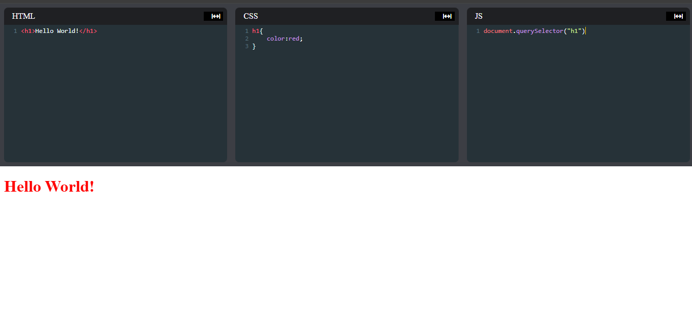

# Simple Code Editor

This is a simple code editor built with React.js that allows users to write and preview HTML, CSS, and JavaScript code. It is designed for quick coding and testing, with live preview functionality.

## Features

- **Real-time Code Preview**: See your changes instantly in the preview pane.
- **HTML, CSS, and JavaScript Support**: Write and test web code in a single interface.
- **Responsive Design**: Mobile-friendly layout for coding on different devices.
- **Separate Editors**: Dedicated sections for HTML, CSS, and JavaScript code.
- **Live Preview**: Automatically renders the output based on the code input.

## Technologies Used

- **React.js**: Frontend framework for building the editor UI.
- **HTML, CSS, JavaScript**: Core web technologies for content rendering.
- **CSS**: For styling the editor layout and preview pane.
  

